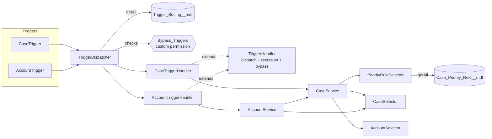

# Apex Trigger Framework

A metadata-driven Apex trigger handler framework with service and selector layers, shown on bulk-safe Case and Account logic for a fictional bank.

> **Disclaimer:** Representative portfolio project built independently with synthetic data. It is not code from any employer or client.
>
> "Northwind Credit Union" is fictional. Every record, rule and threshold in this repository is synthetic.

## Business use case

A credit union's service team works card disputes, fraud alerts and loan inquiries. Two problems come up again and again:

1. **Inconsistent prioritisation.** Agents set Priority by hand, so SLAs are missed for high-value or premium-tier members.
2. **Duplicate disputes.** The same card transaction gets disputed twice (by phone and through the web), which creates double work and can lead to double refunds.

This project fixes both in a way that admins can configure and that still works for large data loads:

- Case **Priority** and **SLA Due** are set from `Case_Priority_Rule__mdt` (service category x member tier), and disputes at or above a threshold are escalated.
- A second **open** Card Dispute for the same Account and transaction reference is blocked, whether the duplicate is in the same request or already in the database.
- When a member's tier changes, their open cases are re-prioritised.
- Any handler can be switched off, re-ordered or bypassed without an Apex deployment.

## Architecture



| Layer | Classes | Responsibility |
| --- | --- | --- |
| Trigger | `CaseTrigger`, `AccountTrigger` | One line each: `TriggerDispatcher.run(Case.SObjectType)` |
| Framework | `TriggerDispatcher`, `TriggerHandler`, `TriggerSettingSelector`, `TriggerFrameworkException` | Resolve handlers from metadata, dispatch by context, recursion control, bypass |
| Handler | `CaseTriggerHandler`, `AccountTriggerHandler` | Decide which records changed in a way that matters, then call services |
| Service | `CaseService`, `AccountService` | Business rules (priority/SLA, duplicate disputes, tier changes) |
| Selector | `CaseSelector`, `AccountSelector`, `PriorityRuleSelector` | All SOQL and custom metadata reads |

### Framework behaviour

- **Context dispatch.** `TriggerHandler.run()` switches on `Trigger.operationType` and calls one of seven virtual hooks (`beforeInsert`, `afterUpdate`, ...). Handlers override only what they need.
- **Recursion control.** A per-handler depth counter, set by `Max_Recursion_Depth__c` (default 1). The counter is decremented in a `finally` block, so the second and later 200-record chunks of a large DML still run. Only true re-entry (a handler causing its own trigger to fire again) is blocked. A simple "has run" static flag would silently skip records after the first chunk.
- **Bypass, three ways:**
  1. `Is_Active__c = false` on the `Trigger_Setting__mdt` record (no deployment needed).
  2. The `Bypass_Triggers` custom permission, granted through the `Trigger_Bypass` permission set, for data loads and migrations.
  3. `TriggerHandler.bypass('CaseTriggerHandler')` / `clearBypass(...)` for in-transaction skips from Apex.
- **Ordering.** Several handlers per object run in `Execution_Order__c` order.
- **Testability.** Handlers accept an injected context through `withContext(...)`, so they can be unit tested without DML. Selectors expose `@TestVisible` mock seams for custom metadata.

### Security model

| Operation | Mode | Why |
| --- | --- | --- |
| Account tier lookup | `WITH USER_MODE` | Normal read: honour CRUD, FLS and sharing |
| Open cases for re-prioritisation | `WITH USER_MODE` | Normal read |
| Re-prioritisation update | `Security.stripInaccessible(AccessType.UPDATABLE, ...)` and `Database.update(..., AccessLevel.USER_MODE)` | Fields the user cannot edit are removed, and the DML enforces sharing |
| Duplicate-dispute lookup | `WITH SYSTEM_MODE` (documented in `CaseSelector`) | Data-integrity check: an agent must be blocked even when the existing dispute belongs to a team they cannot see. Only the CaseNumber is shown in the error |

## Tech stack

Apex (API 62.0), Custom Metadata Types, Custom Permissions, Permission Sets, Salesforce CLI (`sf`), Prettier with `prettier-plugin-apex`, Salesforce Code Analyzer v5 (PMD), GitHub Actions.

## Project structure

```
apex-trigger-framework/
├── .github/workflows/ci.yml
├── config/project-scratch-def.json
├── data/                          # sf data import tree plan (synthetic)
├── force-app/main/default/
│   ├── classes/                   # framework, handlers, services, selectors, tests
│   ├── customMetadata/            # Trigger_Setting.* and Case_Priority_Rule.* records
│   ├── customPermissions/         # Bypass_Triggers
│   ├── objects/
│   │   ├── Account/fields/        # Member_Number__c, Member_Tier__c
│   │   ├── Case/fields/           # Service_Category__c, Transaction_Reference__c, Disputed_Amount__c, SLA_Due__c
│   │   ├── Case_Priority_Rule__mdt/
│   │   └── Trigger_Setting__mdt/
│   ├── permissionsets/            # Northwind_Service_Agent, Trigger_Bypass
│   └── triggers/                  # CaseTrigger, AccountTrigger
├── code-analyzer.yml
├── package.json
└── sfdx-project.json
```

## Setup

Prerequisites: Salesforce CLI (`npm install --global @salesforce/cli`), a Dev Hub org, Node.js 22+, and Java 11+ (used by Prettier's Apex parser and by PMD).

```bash
# 1. Authorise your Dev Hub (opens a browser)
sf org login web --set-default-dev-hub --alias devhub

# 2. Create a scratch org
sf org create scratch --definition-file config/project-scratch-def.json --alias atf --set-default --duration-days 7

# 3. Deploy
sf project deploy start --target-org atf

# 4. Give yourself the agent permission set
sf org assign permset --name Northwind_Service_Agent --target-org atf

# 5. Load synthetic sample data
sf data import tree --plan data/sample-data-plan.json --target-org atf

# 6. Run the Apex tests
sf apex run test --target-org atf --test-level RunLocalTests --code-coverage --result-format human --wait 20
```

## Local checks

```bash
npm ci
npm run prettier:verify          # formatting (also parses every Apex file)
sf plugins install code-analyzer
sf code-analyzer run --config-file code-analyzer.yml --workspace . --target force-app --rule-selector Recommended
```

This repository has no LWC or JavaScript, so there are no Jest tests.

## Synthetic sample data

`data/sample-data-plan.json` loads three fictional members (`NW-000101` to `NW-000103`, one per tier) and four cases. After the import, each case already shows the Priority and SLA Due that the rules produce. The member names, numbers and transaction references are made up.

## Configuration template

Register a new handler by adding a custom metadata record. No Apex change is needed in the dispatcher.

```xml
<!-- force-app/main/default/customMetadata/Trigger_Setting.Opportunity_Handler.md-meta.xml -->
<CustomMetadata xmlns="http://soap.sforce.com/2006/04/metadata"
    xmlns:xsi="http://www.w3.org/2001/XMLSchema-instance" xmlns:xsd="http://www.w3.org/2001/XMLSchema">
    <label>Opportunity Handler</label>
    <protected>false</protected>
    <values><field>SObject_API_Name__c</field><value xsi:type="xsd:string">Opportunity</value></values>
    <values><field>Handler_Class__c</field><value xsi:type="xsd:string">OpportunityTriggerHandler</value></values>
    <values><field>Is_Active__c</field><value xsi:type="xsd:boolean">true</value></values>
    <values><field>Execution_Order__c</field><value xsi:type="xsd:double">10.0</value></values>
    <values><field>Max_Recursion_Depth__c</field><value xsi:type="xsd:double">1.0</value></values>
    <values><field>Bypass_Custom_Permission__c</field><value xsi:type="xsd:string">Bypass_Triggers</value></values>
</CustomMetadata>
```

Then write `OpportunityTriggerHandler extends TriggerHandler` and a one-line `OpportunityTrigger`.

Priority rules are `Case_Priority_Rule__mdt` records. The lowest `Rule_Order__c` that matches wins, and `*` matches anything:

| Rule | Category | Tier | Priority | SLA hours |
| --- | --- | --- | --- | --- |
| Fraud_Any | Fraud Alert | * | High | 4 |
| Dispute_Private | Card Dispute | Private | High | 8 |
| Dispute_Premier | Card Dispute | Premier | High | 24 |
| Dispute_Standard | Card Dispute | Standard | Medium | 48 |
| Loan_Any | Loan Inquiry | * | Medium | 72 |
| Default_Rule | * | * | Low | 120 |

Disputes of 10,000 or more are always set to High, with an SLA of at most 24 hours (constants in `CaseService`).

## Security considerations

- CRUD, FLS and sharing are enforced on reads and writes (see the security model table above). The one `SYSTEM_MODE` query is deliberate, minimal and documented.
- Users get least-privilege access through permission sets, not profiles. Tests run as a **Standard User** with `Northwind_Service_Agent`, not as a System Administrator.
- The bypass is a **custom permission**, so who can bypass is visible and auditable in Setup. It is not a hidden hard-coded flag.
- There are no credentials, endpoints or personal data anywhere in the repository. Test users use `@example.com` addresses.

## Testing approach

| Test class | Focus |
| --- | --- |
| `TriggerHandler_Test` | All 7 contexts dispatch correctly, re-entry blocked at max depth, sequential chunks not blocked, runtime bypass |
| `TriggerDispatcher_Test` | Inactive settings skipped, missing or invalid handler classes raise `TriggerFrameworkException` |
| `TriggerSettingSelector_Test` / `PriorityRuleSelector_Test` | Filtering, ordering, wildcard matching, shipped metadata present |
| `CaseTriggerHandler_Test` | **200-record bulk** insert, high-value escalation, default rule, in-batch and existing duplicates (**200 vs 200** bulk negative), closed disputes do not block, re-opening is checked, runtime and **custom-permission bypass**, DML-free handler test |
| `AccountTriggerHandler_Test` | 200-record default tier, invalid member numbers on insert and update, **200-account tier upgrade** re-prioritises open cases, closed cases untouched |

`TestDataFactory` builds the synthetic users, accounts, disputes and rules. Assertions use the `Assert` class, and every assertion has a message.

> Apex tests need a Salesforce org. They were written and statically reviewed for this portfolio, and they run in CI when a Dev Hub secret is configured (see below).

## Continuous integration

`.github/workflows/ci.yml` runs on every push to `main` and on every pull request:

1. **static-checks:** `npm ci`, `prettier --check` (this also proves every `.cls` and `.trigger` parses), and Salesforce Code Analyzer (Recommended rules). The job fails on any High or Critical finding (`--severity-threshold 2`), and the HTML report is uploaded as an artifact.
2. **scratch-org-validate (optional):** runs only when the repository secret `SFDX_AUTH_URL` (a Dev Hub auth URL) exists. It creates a one-day scratch org, deploys, runs `RunLocalTests` with coverage, and always deletes the org afterwards. Forks without the secret skip this job cleanly. No secret value is stored in the repository.

## Limitations and future enhancements

- Closed statuses are a constant (`Closed`). A production version would read `CaseStatus.IsClosed`.
- SLA uses calendar hours. A production version would use `BusinessHours.add()`.
- Recursion control is per handler, not per record. A per-record "already processed" set could be added for very complex chains.
- Possible additions: a Unit of Work for cross-object DML, platform-cache backed settings, a `Trigger_Setting__mdt` admin LWC, and handler-level performance logging.

## License

[MIT](LICENSE). Copyright (c) 2026 Vanaja Kumari.
